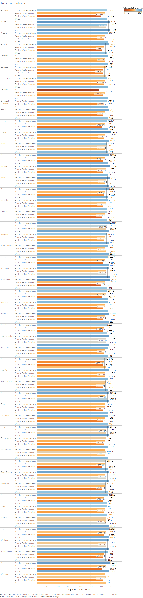
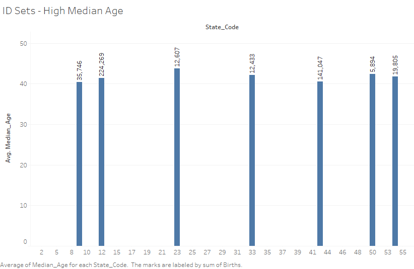
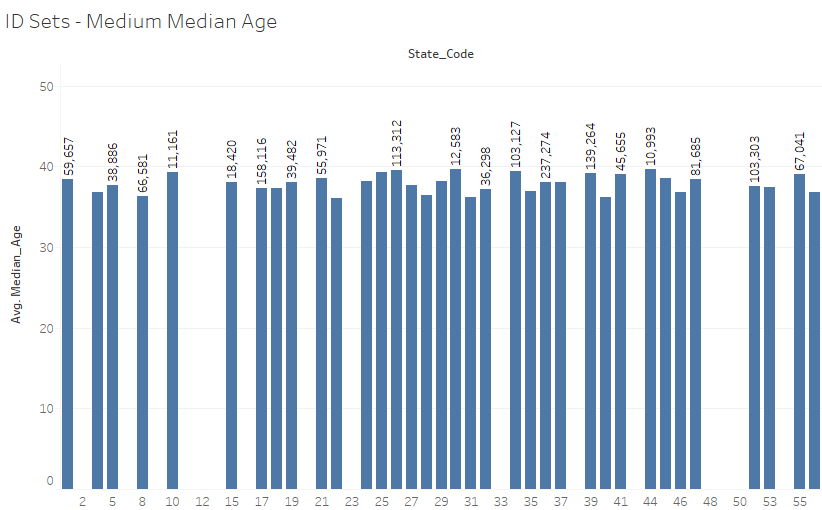
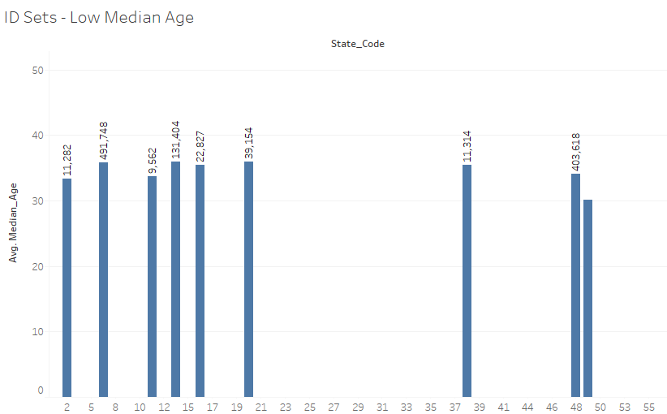
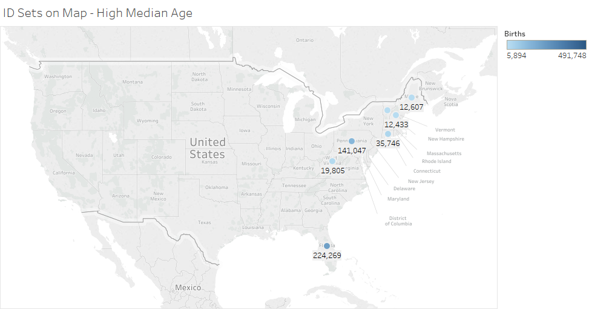
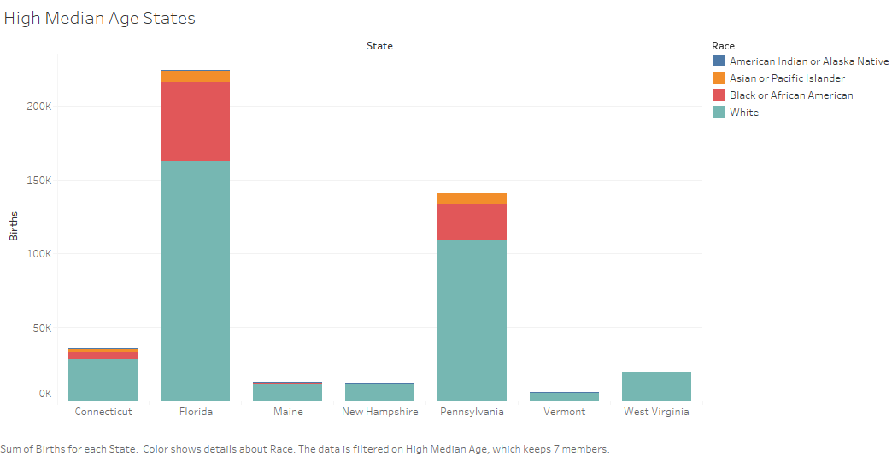
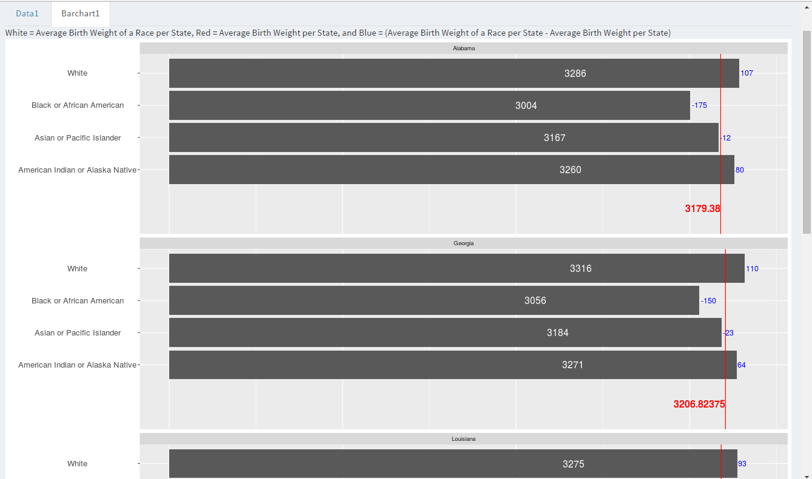
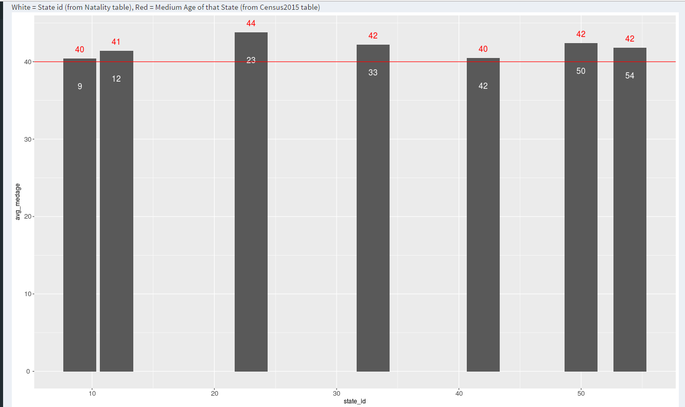
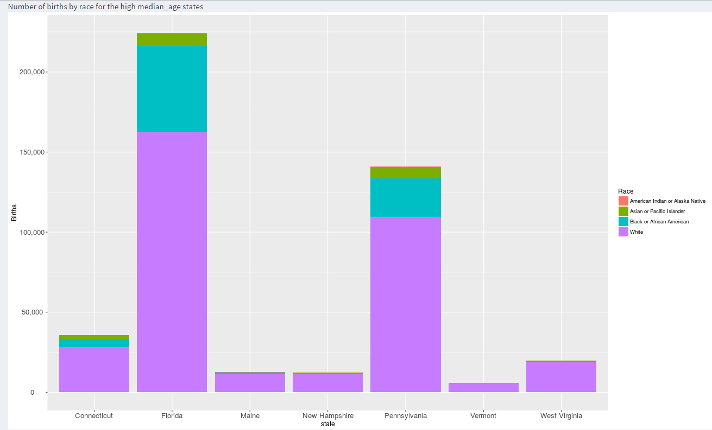

<center></center>

#**Introduction**
The Natality.csv contains information of Natality in each state. This includes the baby's gender, birth weight, mother's age and total number of births.
The Census2015.cvs file contains the median age of the total population in each state.

#**R Configuration**
Below is our sessionInfo().

```{r sessionInfo}
sessionInfo(package=NULL)
```


#**ETL Script**


```{r}
source("../01 Data/ETL.R")
```
```{r, code= readLines("../01 Data/ETL.R"), eval=FALSE}
```

#**The Cleaned up data**
The cleaned up data file, Natality.csv, is on conneyc's account under dataset S17 DV Project 5. The TAs have been added as contributors and can download the file from the link provided below.

https://data.world/conneyc/s-17-dv-project-5

#**The Census Data**
The data file containing the census data we are using, Census2015.csv, is on conneyc's account under dataset S17 DV Project 5. The TAs have been added as contributors and can download the file from the link provided below.

https://data.world/conneyc/s-17-dv-project-5


#**Tableau Visualizations**

<center></center>
This visualization is a boxplot of state vs births. It is filtered by Race and Births and has the detail of the gender of the births. It is observed that California has the largest number of births for female and males followed by Texas. 

<center></center>
This Treemap displays the count of the average age of mothers for each age in 0.5 bins, by race. It is colored by the count, with the race and average age as text. When the mouse is hovered over a box, it tells you the count number. For Asians, it is seen that most mothers are 30.5 years old, white mothers are 28, African Americas are 26, and Natives are 26.5. Asian mothers have babies the lastest while African Americans have them the earliest. 


<center></center>

This graph shows average birth weight in grams for each race in each state. A reference line was added that depicts the average birth weight for that state overall. The mark label for the reference line was formatted with a "g" at the end to convey the unit grams.
The data reflects that White babies and American Indian/Alaskan babies tend to weigh more than the average baby in each state.

<center></center><br>

This graph like the first one shows average birth weight in grams for each race in each state and the reference line, but the calculated difference from average is applied. The calculated difference is the average birth weight (for that race in that state) minus the total average birth weight of all the states. It is used for color and text and displayed by the mark labels, the color of the bars, and numbers are shown when the mouse is hovered over each bar. The trend of White and American Indian/Alaskan babies weighing more than the average baby remains the same. 
<hr>

<center></center><br>
<center></center><br>
<center></center><br>

The median age of each state from the US Census 2015 data was joined with the Natality data through states= AreaNae.
These graphs depict the median age of each state (Census2015.cvs) by its numerical state code id (Natality.csv), labelled with the total sum of births within that state. States with a median age over 40 were selected for a High Median Age States set. States with a median age between 36 and 40 were selected for a Medium Median Age Set. All other states were designated for a Low Median Age set.

<center></center><br>
<center>.png)</center><br>
<center>.png)</center><br>

This visualization uses State, State_Code, and Births from Natality.csv and Median Age from Census2015.csv.
These graphs were created by generating a US map and plotting the High Median Age set, Medium Median Age set, and Low Median Age set on separate pages. The sum of births in each state is depicted by the color of each dot and the label associated with it.

<hr>

<center></center><br>

This graph shows the sum of births in each of the High Median States, with each bar color broken down by the number of births contributed by each race within that state. 

#**Shiny Visualizations**
Our visualizations are published in an application on our accounts:

https://kellyjennings.shinyapps.io/project62/

https://conneyc.shinyapps.io/project6/

https://cliu42.shinyapps.io/project6/

Here are screenshots of the Shiny visualizations:

<center></center><br>

This Shiny visualization is similar to the Table Calculations Tableau visualization, filtered for states in the deep south. It compares the average birth weights of babies of different races in each state. The white text on the bars is the average birth weight for a race in that state. The red Reference Line and its label show the average birth weight per state. The blue text is a Table Calculation that shows the difference between the state and race average. An interesting observation is that for these southern states, white babies and American Indian/Alaskan native babies have birth weights above the state average while black/African American babies and Asian/Pacific Islander babies have birth weights below the state average.


<center></center><br>

This visualization is the Shiny version of our ID Set- High Median Age Tableau visualization. We filtered the data to only contain the set of states with a median age of 40 or above, which you can observe from the red Reference Line. We inner joined on columns AreaName and State in order to show the median age from the census table and the state ID from the natality table. It is interesting that the High Median Age States tend to be in the Northeast.

<center></center><br>

The last visualization contains the set of High Median Age States and their number of births, colored by race. We used a join to get the median age from the census data and the number of births from the natality data. Note that the number of births reflects the population of these states, and the population of the races within these states.


