<center></center>

#**Introduction**
The Natality.csv contains information of Natality in each state. This includes the baby's gender, birth weight, mother's age and total number of births.
The Census2015.cvs file contains the median age of the total population in each state.

#**R Configuration**
Below is our sessionInfo().

```{r sessionInfo}
sessionInfo(package=NULL)
```


#**ETL Script**


```{r}
source("../01 Data/ETL.R")
```
```{r, code= readLines("../01 Data/ETL.R"), eval=FALSE}
```

#**The Cleaned up data**
The cleaned up data file, Natality.csv, is on conneyc's account under dataset S17 DV Project 5. The TAs have been added as contributors and can download the file from the link provided below.

https://data.world/conneyc/s-17-dv-project-5

#**The Census Data**
The data file containing the census data we are using, Census2015.csv, is on conneyc's account under dataset S17 DV Project 5. The TAs have been added as contributors and can download the file from the link provided below.

https://data.world/conneyc/s-17-dv-project-5


#**Visualizations**

#*Boxplots*
<center></center><br>
This visualization is a boxplot of state vs births. It is filtered by Race and Births and has the detail of the gender of the births. It is observed that California has the largest number of births for female and males followed by Texas. 

<center>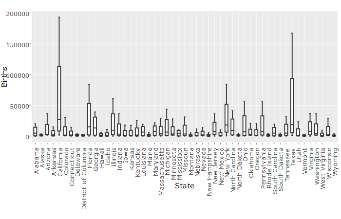</center><br>
This is the same data visualization done in Shiny.

<hr>

#*Histograms*
<center>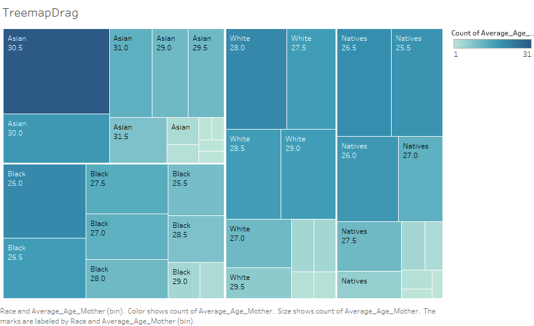</center><br>
This Treemap displays the count of states that fall in each average age for mothers (in 0.5 bins), by race. The graph reveals the most common to least common age for giving birth in each race. Boxes are colored by the count, with the race, and average age, and count number as text. For Asians, it is seen that most mothers are 30.5 years old, white mothers are 28, African Americas are 26, and Natives are 26.5. Asian mothers have babies the latest while African Americans have them the earliest. 

<center>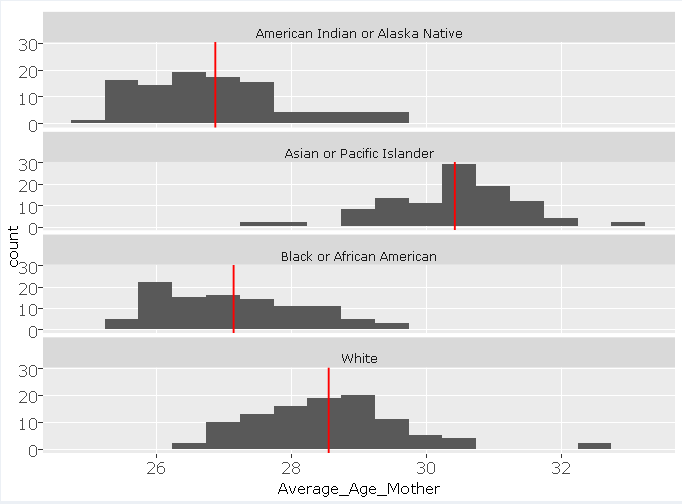</center><br>

This faceted Shiny histogram is similar to the Tableau treeplot, since it shows the most common average mother age for each race. However, it also includes a red average line for each race, so you can easily see that the average age of mother is highest for Asian mothers and lowest for African Americans.

<hr>

#*Scatterplots*
<center>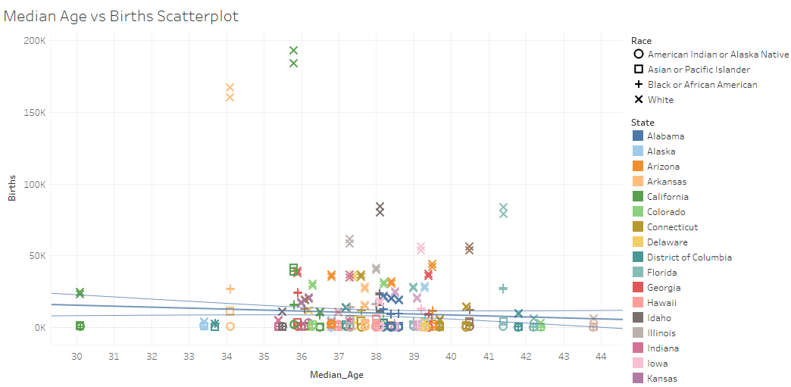</center><br>
This scatterplot compares the median age and number of births of each state. Each point signifies the median age of the state and number of births of each gender for a specific race within that state. The shape of the points classify the race and the color classifies the state. A trend line was added which shows Births = -682.411*Median_Age + 35676.1, meaning as the median age of the state increases, there appears to be a decrease in the number of births.

<center>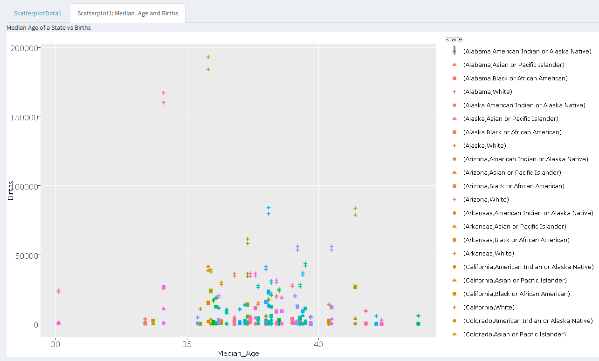</center><br>
This is the same visualization done in Shiny.

<hr>

#*Crosstabs*
<center>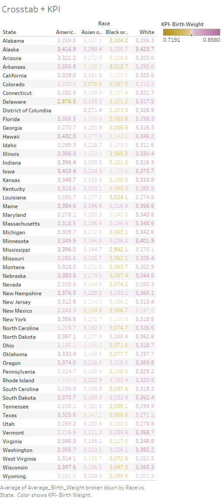</center><br>
This graph shows average birth weight per state by race. It is colored by the calculated field (KPI): AVG(average birth weight)/4000. The number 4000 is an average healthy birth weight in the US. The data reflects that white babies tend to weigh more than the other races.

<center>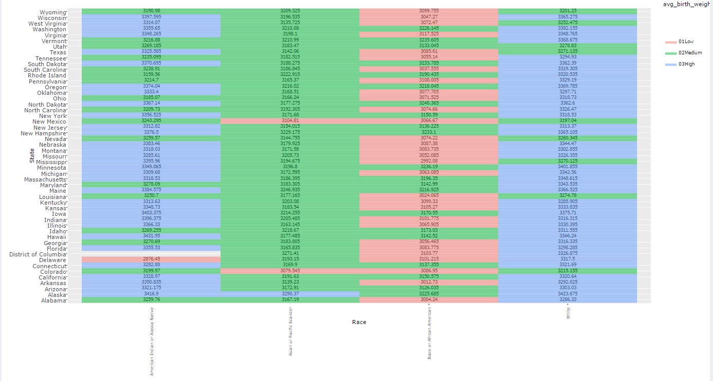</center><br>
This is the same visualization done in Shiny.

<hr>

<center>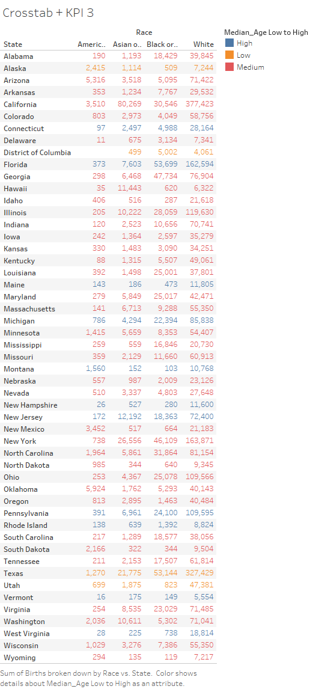</center><br>

This graph was created by joining Natality.csv with Census2015.csv through State= AreaName. It shows the total number of births for each race per state using the data from Natality.csv. The number of births for corresponding states is colored by the Median_Age column from Census2015.csv using parameters. The parameters are low: 0-34.7, medium: 34.7-39.3, and high: 39.3+. Regardless of median age, Whites have the largest number of births followed by Black or African, Asian or Pacific Islander then American Indian or Alaska Native. However, this trend is most likely a reflection of the existing demographic where the majority of the population is White. Texas is a low Median age state and has a high number of births. 

<center>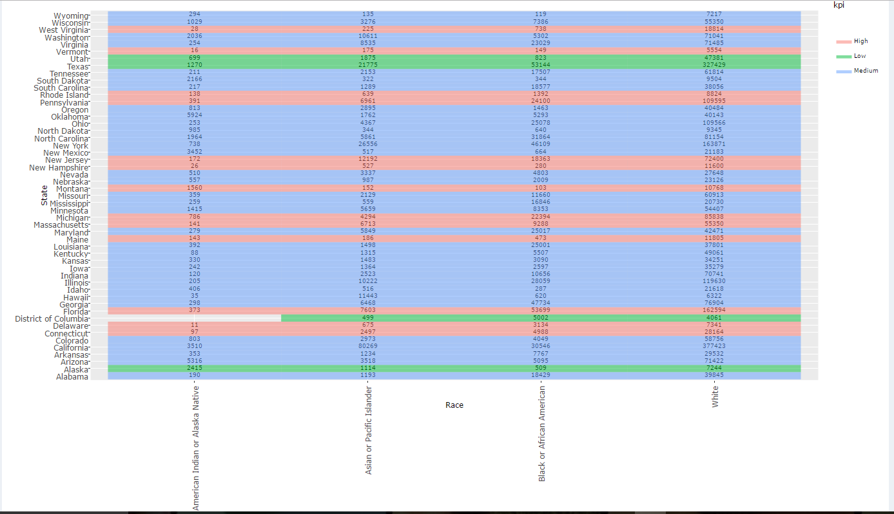</center><br>
This is the same visualization done in Shiny.

<hr>

#*Barcharts*
<center>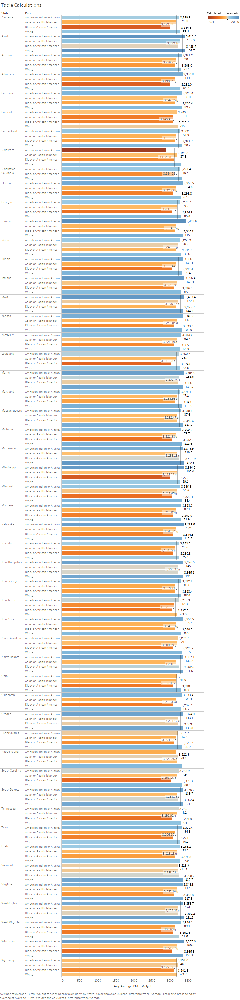</center><br>
This graph shows average birth weight (in grams) for each race in each state. There is a reference line that is the average birth weight for the state, and the calculated difference from average is applied. The calculated difference is the average birth weight (for that race in that state) minus the total average birth weight of all the states. It is used for color of the bars and text and displayed by the mark labels. Numbers are shown when the mouse is hovered over each bar.
The data reflects that White babies and American Indian/Alaskan babies tend to weigh more than the average baby for each state.
<br>

<center>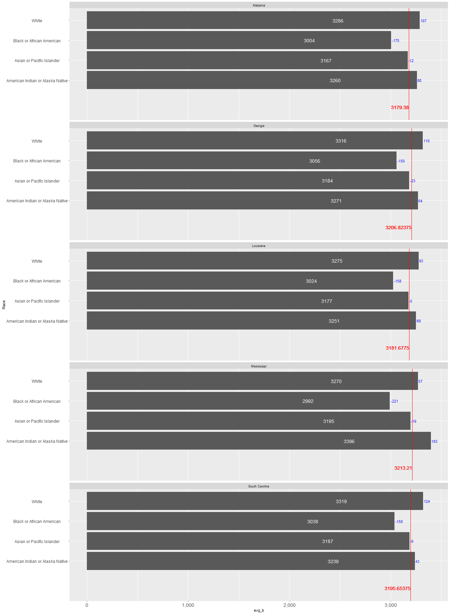</center><br>
This is the Shiny version. The states chosen are states in the deep south, and the trend of White and Native babies weighing more continues for these states. The average line shows the average birth weight for the state, and the calculated difference is the difference between the average birth weight in the state and the average birth weight for the specific race in the state.

<hr>

<center>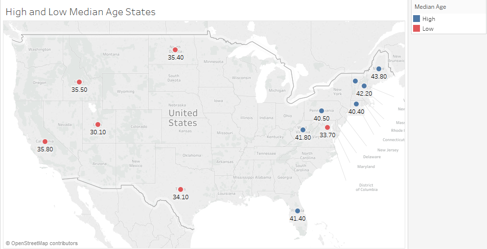</center><br>
We created a set called high median age, which are the states with a median age of over 40. We created another set called low median age which are states with a median age of 35.8 and under. This graph mapped those two sets of states. We observed that the high median age states are all in the east coast while the low median age states tend to be in the central and western US. 


<hr>

<center>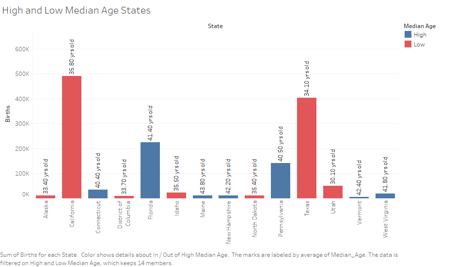</center><br>
This graph used data from Census2015 (Median Age) and Natality (Births, Race) joined by State.
It shows the sum of births in the 7 Highest and 7 Lowest Median Age States. The red bars are the low median age states while blue are the high ones. Each bar is labeled with their median age. Maine has the highest median age at 43.80 while Utah has the lowest at 30.10 years old. There are low and high birth numbers in both the high and low median age states, so there isn't an apparent direct correlation between median age and the number of births. However, it is interesting that California and Texas as low median age states have the highest birth numbers; in total the low median age states have a larger sum of births than the high median age states.

<center>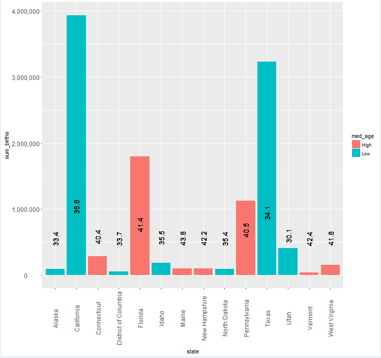</center><br>
The Shiny version is similar for this visualization.

<hr>

#**Shiny Application**
Our visualizations are published in an application on this account:

https://conneyc.shinyapps.io/finalproject/
